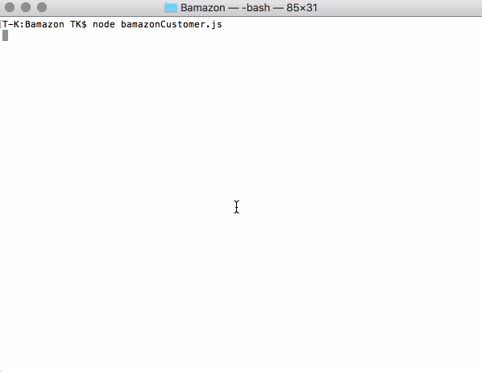
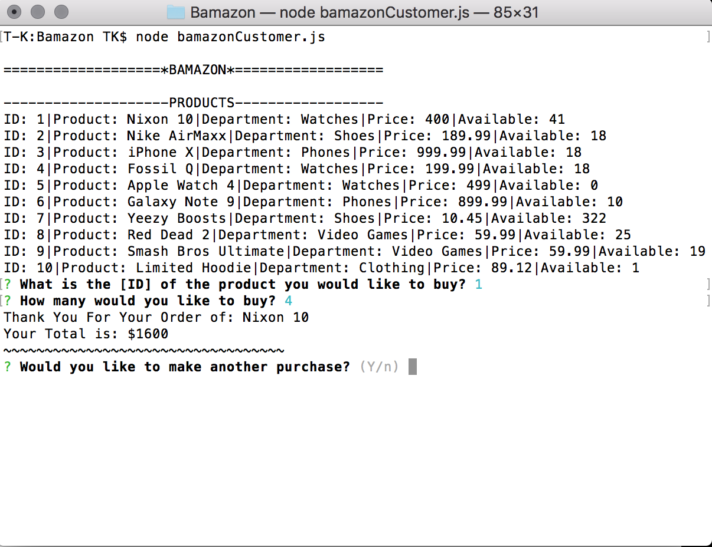
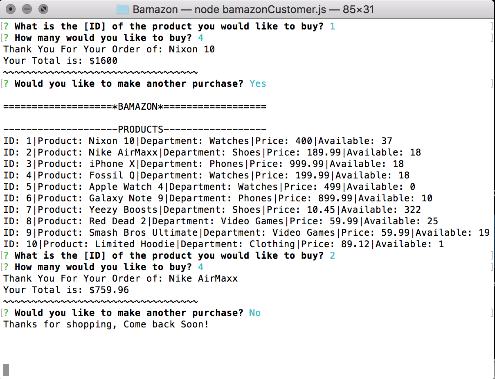
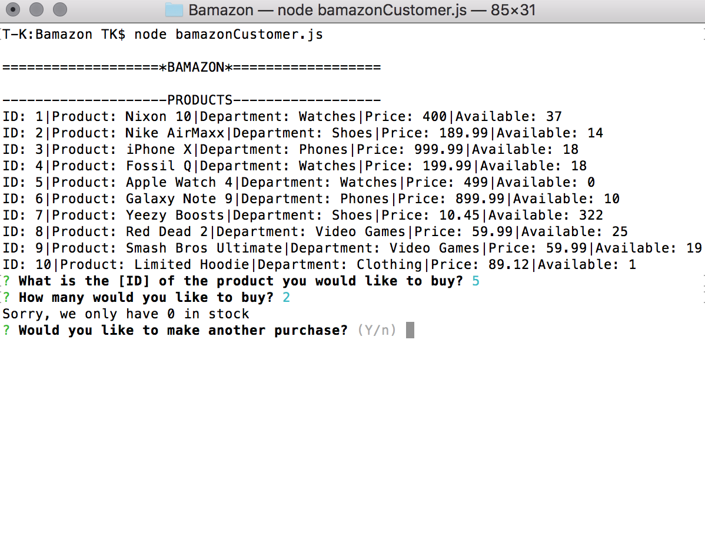

# Bamazon

## Overview

In this activity, you'll be creating an Amazon-like storefront with the MySQL skills you learned this week. The app will take in orders from customers and deplete stock from the store's inventory. As a bonus task, you can program your app to track product sales across your store's departments and then provide a summary of the highest-grossing departments in the store.

Make sure you save and require the MySQL and Inquirer npm packages in your homework files--your app will need them for data input and storage.

- - -

## App in Action

- - -

## Screenshots

1. The customer chooses an ID and quantity of product desired. If item and quantity are available,
they are given a check-out with an updated price. They are then asked if they want to make another purchase. 

- - -

2. If the customer wants to make another purchase, the inventory list is shown again. The stock quantity is updated from previous purchase. If they do not wish to purchase anything else, the app ends.

- - -

3. If there is none of that item in stock, they are alerted there is none available.

- - -
### Technologies Used
* MySQL
* JavaScript
* Inquirer
* CLI

